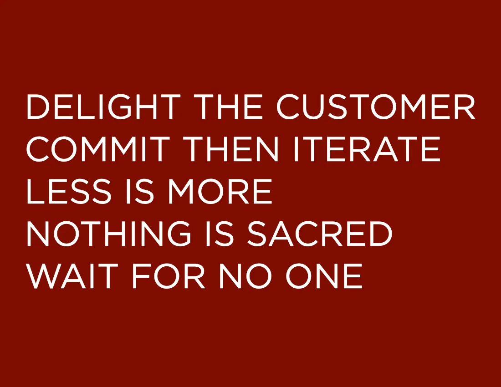

# 5 Rules for Getting Things Done
by Erik Peterson — Dec 9, 2019

---

**On the wall above my desk are five rules, and they are the framework for how I get things done.**

I revisit these rules every year, and they are subject to themselves. Always iterating, words paired to only those most important, without fear of criticism and at whatever pace necessary. They are also in a deliberate order. First and foremost, they must delight you, [the customer](https://youtu.be/Revmkhxu7dk?t=85).

I started developing these rules over a decade ago with a lot of trial and error and, more importantly, a lot of help from the teams I’ve been a part of and led. Over the years, I’ve not found anything more succinct to guide highly productive teams than these five rules, and it should be no surprise that when CloudZero was founded, we built our culture with these rules as its foundation. Even as I’ve worked at very different organizations with different philosophies, cultures, and processes, these rules (in all their iterations) have been my guide.

## Understanding the Rules

To live by these rules requires a lot more than printing them out and hanging them on the wall. You must practice them daily, spend time reflecting on their meaning, and hold yourself and your peers accountable. In many ways, I think this is the shortcoming of most software engineering dogma in general (of which there is legion).

The agile manifesto is a great example. Everyone in software engineering has heard of it, and many organizations swear by it, yet how many of us have found our organizations valuing people and interactions over process and tools, customer collaboration vs. contract negotiation, or rapid response to change vs. rigid top-down planning? How many of you have worked in an environment where delivering customer value was the prime directive? You have to practice what you preach.

# 1. Delight the Customer

> Get closer than ever to your customers. So close in fact, that you tell them what they need before they realize it themselves. — Steve Jobs

This one sounds straightforward, but it is easy to lose your way. You could confuse this to mean that you should listen passionately to your customers and do whatever they ask. If you are a consultant, that’s perhaps good advice, but if you are building a product, this will not satisfy your customers. Jeff Bezos, for example, often points to an obsessive-compulsive focus on the customer as the primary driver of Amazon’s success; however, how often do you hear Amazon doing exactly what customers asked for?

Focusing on the customer is only part of the solution. To delight a customer, you have to exceed their expectations and go beyond their imagination in what you deliver. The way you get there is an obsessive-compulsive focus on solving customer _problems_. The challenge is that the problems your customers want you to solve are **_very hard_** to identify. Sometimes the real problem worth solving is buried behind a dozen other problems your customer won’t pay for but are required to get there. Other times your customers will send you down the wrong path by pointing out problems they don’t have. That makes delighting the customer so hard, and you need to be ready to commit to the journey. Use your time with customers to listen intently and build empathy and understanding using the [5 Whys](https://en.wikipedia.org/wiki/5_Whys). Once convinced that you understand your customer’s problems, spend some time trying to prove yourself wrong and seek out people who disagree. The rest is on you, your intuition, and your willingness to commit and iterate.

# 2. Commit then Iterate

> Art is never finished, only abandoned. — Leonardo da Vinci

Software, much like art, is also never finished, only abandoned.

Unlike art, great software and great software companies are always a team effort. Sometimes getting a team to commit however, can be hard. Lots of opinions will (and should) compete for attention until a decision is made, but once that decision is made, you need everyone to commit. So how do you ensure that happens? You get religious about iteration.

You have likely heard the phrase “Disagree and commit,” something often attributed to Jeff Bezos or, more accurately, Andrew Grove. The idea is that disagreement and debate are welcome upfront, but once a decision is made, disagreement is put aside, and you commit. I think disagree and commit is a powerful concept, but its intentions are misplaced. Instead of focusing on what comes before the commit, along with the implied negativity of disagreement, it is what happens after you commit that is far more impactful. Effective teams don’t just disagree and commit. They iterate.

**Don’t let perfect be the enemy of good enough, but never stop chasing perfection.**

When a team understands that iteration is not just expected, **it is required**, commitment happens faster. You have removed the penalty for changing one’s mind both for those that might have disagreed with the initial direction and also for those making the decision. When your team understands that it must commit **and then** iterate, you remove the pressure to get it right on the first try.

Be warned, however! Other parts of your business will claim victory the moment any customer appears delighted and push you to stop iterating. Don’t let this happen! The first signs of delight are often based on your customers’ perception of future value, not actual value, and you still have a ways to go.

If something you build has the great fortune of delighting someone, don’t stop there and abandon it. Stay committed and keep going. If it was worth doing, it’s worth refining.

# 3. Less is More

> Je n’ai fait celle-ci plus longue que parce que je n’ai pas eu le loisir de la faire plus courte.
> 
> I have made this longer than usual because I have not had time to make it shorter.
> 
> — Blaise Pascal

Less is more. This one is so hard to get right. Blaise Pascal was the first to observe this when he wrote those words. Since then, many similar quotes have been said throughout time, all with the same claim: **To do less, one has to work harder**. That work is crucial because less **_is_** more.

But why is less, more? This concept can be applied to almost all aspects of a business:

**Engineering:** _Every line of code is a liability._

**Sales:** _A smaller but more qualified pipeline will close faster._

**Marketing:** _The more concise your message, the easier it is to understand._

**Product:** Fewer _features, better focus, happier customers_

**Finance:** _Spend on only what matters. Show me your budget, and I’ll show you your priorities._

Enforce this by pushing the team to devote a certain percentage of time every iteration to refactoring. Refactoring is also an excellent opportunity to remove features that don’t delight. Be ruthless when refactoring and abandon the parts that your market won’t care about, stay committed to the parts that delight. As Steve Jobs said, “**_Focus is about saying no_**.”

# 4. Nothing is Sacred

> Sacred cows make the best hamburger — Mark Twain

> Your most unhappy customers are your greatest source of learning. — Bill Gates

There are no sacred cows. Regardless of your code, business plan, marketing, or product strategy. If you want to create an environment of high psychological safety, you must also create an environment that seeks out feedback at every turn and is comfortable with negative feedback. You must be ready to listen without getting defensive and be mentally prepared if it is soul-crushing. You must learn to be very suspicious of positive feedback as well. Using the five whys can help you here, but it requires discipline. **This will not be easy, it takes practice, and you will not get it right on your first try.** You very likely will get defensive, you will look for the exit, and you might very well convince yourself right there to give up, don’t!

My advice? Approach it as an out-of-body experience. You are not there, but your representative is, and they have no skin in the game. Their goal is to ask objective questions, get to the root of the issue, and learn as much as possible. You can be emotional later when it's time to empathize and understand where the feedback was coming from.

So how do you know when you’re done? For this, you have to use real data, not intuition. Are your customers using your features as often as you think they should be? Survey them to find out how they feel, and ask them how much time and effort your product saves them. Observe what they actually do.

This style of recursive refinement is even more critical in this era where cloud providers like Amazon Web Services (AWS) are eating the world. I’m often asked if I fear that the product I’m building will be one day be threatened by AWS. While I have many reasons why CloudZero is in a better position to delight its customers and deliver functionality that Amazon won’t, the real answer is, “_Of course they are going to compete with me if I create something of significant value!_” The counter to that competition is a relentless commitment to iteration. Believe it or not, you can move faster than AWS, but you can not sit still. They (or someone else) will absolutely overtake you if you do.

**Don’t be afraid to throw your solution out the window when your customers aren’t embracing it.**

How do you know they aren’t embracing it? You could point to sales as the ultimate indication, but even bad products can make money in the short term. By the time you are really hurting, it might be too late to change course. The leading indicator of product failure is a lack of engagement, both from customers and from your team. The problem for startups is that founders are hopeless optimists, they build passionate teams, and no one wants to accept they might be wrong.

To counter this, you must seek out and telegraph loudly to everyone you work with that you want critical feedback. When you get it, prove that you wanted it by resisting the urge to become defensive. If you aren’t getting pushback, something is wrong; be highly suspicious of positive feedback that isn’t backed by data. If product praise it’s not complemented with actual product engagement, you are fooling yourself in the worst possible way.

# 5. Wait for No One

> If you spend too much time thinking about a thing, you’ll never get it done. — Bruce Lee

[https://www.youtube.com/watch?v=ZXsQAXx_ao0](https://www.youtube.com/watch?v=ZXsQAXx_ao0)
No one is more empowered to solve your problems than yourself. If you are blocked, ask for help; If no one is listening, raise your voice; But if the job isn’t getting done, be ready to take matters into your own hands. The keyword here is decisiveness, no one will ever be upset with you for getting **_something_** done vs. **_nothing_**, in particular, if you are working at a startup.

As your organization grows, you need everyone to embrace the notion that they are fully empowered to do whatever they see fit to get the job done. The agile development tenant would be valuing working solutions over comprehensive documentation, but this concept isn’t limited to engineering. Whatever your team's focus, don’t wait. **_Just do it_**.

You might be thinking that embracing this philosophy is going to step on a lot of toes. If that’s true, you might be working for a company that does not have clear roles and responsibilities (always bad) or one that has intentionally chosen to limit the rate of change (sometimes good). It also might mean **_you_** haven’t invested in figuring out **_how_** to get things done. Don’t confuse this concept with the idea that “It’s better to ask for forgiveness than approval.” Knowing _how_ to get things done is an important part of getting things done. You do, after all, have to work on a team. Just don’t wait for an invitation.

Lastly, if you are a leader or manager on the other side, you have an equally important role to play. If you see other teams embracing this and moving fast, but you now find yourself resenting that they didn’t wait for your input, stop yourself right there. It’s also your responsibility not to wait for them. If you think your team's input will be critical to the mission, don’t wait for the ask. Give it proactively.

# Wrapping it all up: 5 rules, 1 goal

> Delight the Customer
> 
> Commit then Iterate
> 
> Less is More
> 
> Nothing is Sacred
> 
> Wait for No One

These five rules have one goal: **_To enable outstanding, fast-growing software companies_**. That’s where I’ve put them to the test, sometimes with success, other times with failure. I’m still learning as I go, still iterating, and I’d love your help on that journey.

If these rules help you, I’d love to know, and if you think they can be improved, I’d like to hear from you even more. Nothing is sacred, and I’ve published them on GitHub to track changes and collect feedback [https://github.com/silvexis/5rules](https://github.com/silvexis/5rules).

